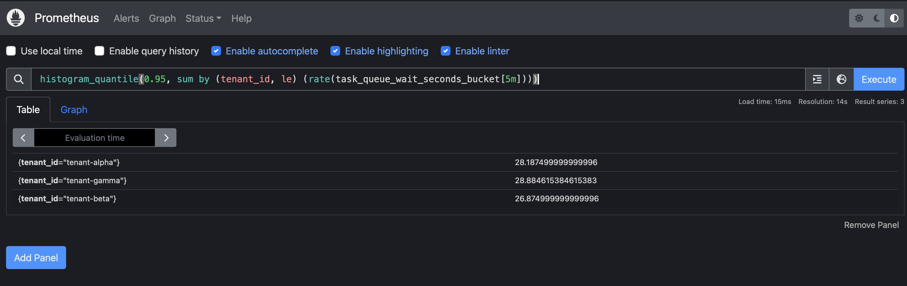
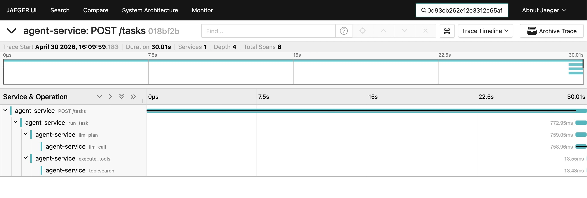
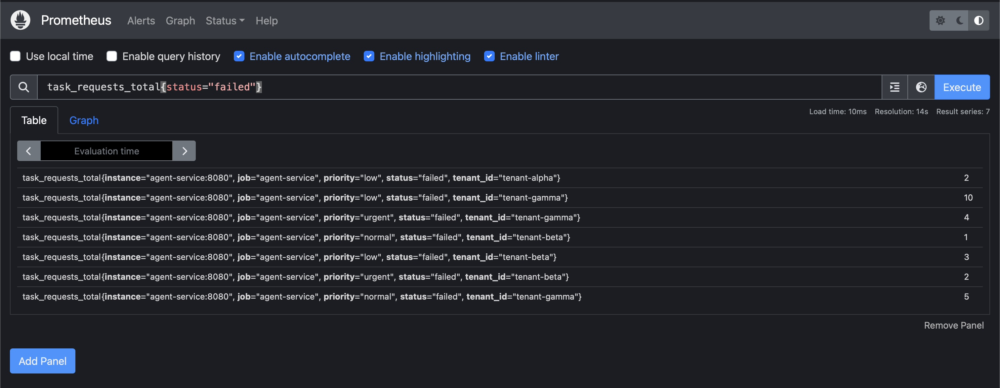
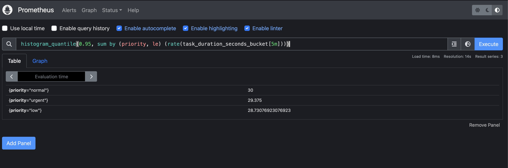
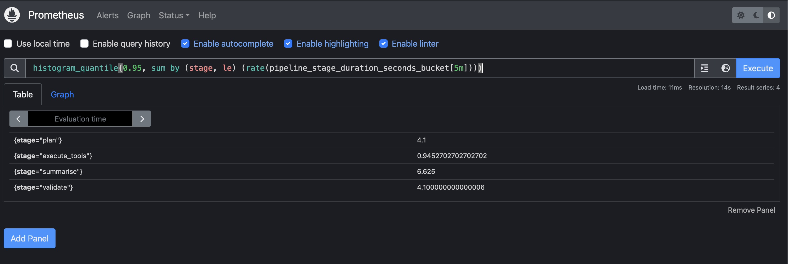
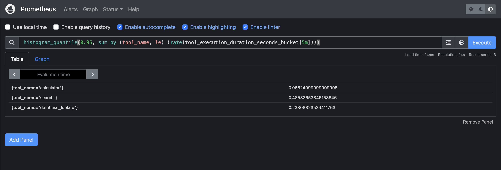
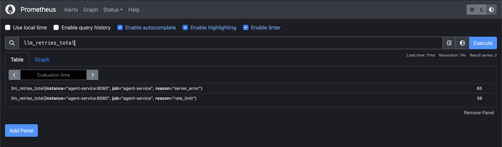
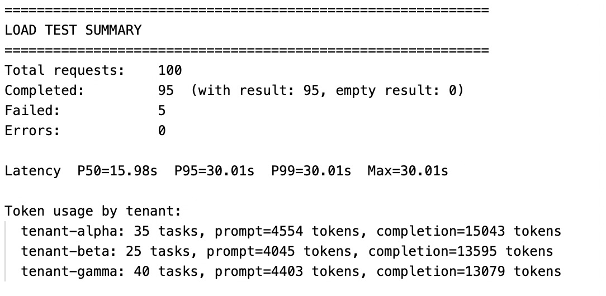
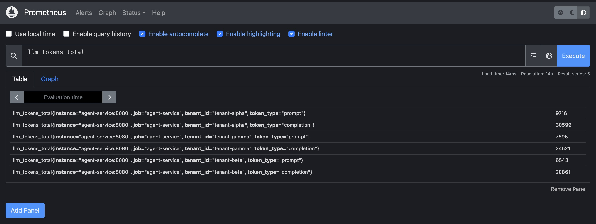

# Diagnosis Report — Agent Execution Service

**Load test:** 100 requests, concurrency 15, 3 tenants, 3 priorities  
**Date:** 2026-04-30  
**Service version:** instrumented (OTel + Prometheus)

---

## How to Reproduce

**1. Start the full stack**

```bash
docker compose up --build
```

Wait until all 5 services are healthy:

```
agent-service   → http://localhost:8080
mock-llm        → http://localhost:8081
jaeger          → http://localhost:16686
prometheus      → http://localhost:9090
grafana         → http://localhost:3000
```

**2. Run the load test**

From the project root (requires `httpx` — `pip3 install httpx` if missing):

```bash
python3 -m tests.test_load
```

Default parameters (`tests/test_load.py`):

| Parameter | Value |
|---|---|
| `TOTAL_REQUESTS` | 100 |
| `CONCURRENCY` | 15 |
| `TENANTS` | tenant-alpha, tenant-beta, tenant-gamma |
| `PRIORITIES` | urgent, normal, low |
| Duplicate rate | ~30% of requests reuse a description (cache trigger) |

**3. View telemetry**

- **Traces:** http://localhost:16686 → select service `agent-service`
- **Metrics:** http://localhost:9090 → use the PromQL queries in each issue section below
- **Logs:** `docker compose logs -f agent-service` (structured JSON, includes `trace_id` on every line)
- **Dashboard:** http://localhost:3000 → "Agent Execution Service" dashboard (auto-loaded)

**4. Reproduce a specific issue**

Each issue section below includes the exact Prometheus query or Jaeger trace ID used to observe it during this run. Re-running the load test will produce new trace IDs but the same patterns.

---

## Summary of Findings

| # | Issue | Severity | Type |
|---|---|---|---|
| 1 | Tenant lock acquired before semaphore — head-of-line blocking per tenant | **Critical** | Implementation bug |
| 2 | Priority field accepted but never used for scheduling | **High** | Design gap |
| 3 | Tools execute sequentially — wastes ~38% of execute_tools time | **Medium** | Implementation bug |
| 4 | Redundant validation LLM call — result discarded, adds latency and cost | **Medium** | Design gap |
| 5 | Unbounded in-memory growth — task_store, cache, execution_log never evicted | **Medium** | Reliability risk |
| 6 | Same retry policy for 429 and 500 — rate-limit errors retried aggressively | **Low** | Implementation bug |
| 7 | Exception handler leaks stack trace and internal URL to API consumers | **High** | Security |
| 8 | Summarise failure path is dead code — `"" is None` always False | **High** | Implementation bug |

---

## Issue 1: Tenant Lock Causes Head-of-Line Blocking

### Discovery path

The first signal was the load test summary: `P50=15.98s  P95=30.01s  P99=30.01s`. For tasks that include 3 LLM calls (each taking 0.1–1s normally), a P50 of nearly 16 seconds is far beyond what execution time explains.

I sliced `task_queue_wait_seconds` by tenant in Prometheus and immediately saw all three tenants with P95 queue waits above 25s:

```promql
histogram_quantile(0.95, sum by (tenant_id, le) (rate(task_queue_wait_seconds_bucket[10m])))
```

```
task_queue_wait_seconds p95 by tenant:
  tenant-gamma: 28.885s   ← worst — nearly the full 30s timeout budget
  tenant-alpha: 28.188s
  tenant-beta:  26.875s
```



### Evidence

**Trace ID:** `018bf2ba260d93cb262e12e3312e65af`  
**Total duration:** 30.01s (timeout)

From the Jaeger trace (see screenshot below), the span breakdown is:

```
POST /tasks        30,010ms   (total — request timed out waiting for response)
  run_task           772.95ms  (actual work — task finally started)
    llm_plan         759.05ms
      llm_call       758.96ms
    execute_tools     13.55ms
      tool:search     13.43ms
```

**Queue wait calculation:**

```
Total request time:   30,010ms
Actual run_task time:    772ms
Queue wait:          29,238ms ≈ 29.24s

=> 97.4% of the 30s budget was spent waiting in queue.
   The task executed correctly in <800ms — it simply never got a slot in time.
```



**Failure distribution this run:**

This run produced 5 timeouts. The lock serialization effect is stochastic — which tenant accumulates the most wait time depends on the order tasks happen to acquire the global semaphore at startup. This run: tenant-gamma timed out 3 tasks, tenant-alpha timed out 2.



Note: the `task_requests_total{status="failed"}` metric is cumulative across the container session; the screenshot captures totals from this load test run and any prior warm-up requests.

**Docker log pattern — queue_wait grows monotonically within a tenant:**

```
{"message": "task_executing", "tenant_id": "tenant-gamma", "queue_wait_seconds": 0.001, ...}
{"message": "task_executing", "tenant_id": "tenant-gamma", "queue_wait_seconds": 4.823, ...}
{"message": "task_executing", "tenant_id": "tenant-gamma", "queue_wait_seconds": 14.109, ...}
{"message": "task_executing", "tenant_id": "tenant-gamma", "queue_wait_seconds": 29.238, ...}  ← timeout trace
```

Each subsequent task for the same tenant waits for all earlier tasks to finish before it can even compete for a semaphore slot. This is the hallmark of lock-before-semaphore head-of-line blocking.

### Root cause

`src/main.py` lines 101–121:

```python
async def _guarded_execute():
    lock = _tenant_locks.setdefault(body.tenant_id, asyncio.Lock())
    async with lock:               # ← tenant lock acquired FIRST
        async with _task_semaphore:  # ← semaphore acquired SECOND (held while waiting)
            return await run_task(...)
```

The tenant lock is acquired **before** the semaphore. This means:

- Task N for a tenant acquires the lock, then blocks waiting for a semaphore slot.
- While waiting for a slot (which could take seconds), it **holds the tenant lock**.
- Every subsequent task for that same tenant queues at the lock, even if semaphore slots are available.
- One slow task serialises the **entire** remainder of that tenant's queue.

Each tenant has a separate lock, so the serialization is per-tenant but affects all three simultaneously under concurrent load.

### Proposed fix

Swap the lock and semaphore order so the lock is held only during actual execution:

```python
async def _guarded_execute():
    async with _task_semaphore:          # ← global slot first (wait here without holding lock)
        lock = _tenant_locks.setdefault(body.tenant_id, asyncio.Lock())
        async with lock:                 # ← tenant lock inside (held only during execution)
            return await run_task(...)
```

Or remove the tenant lock entirely — there is no per-tenant mutable state in the current design that requires serialization.

**Expected impact:** Queue wait drops from 25–29s to near zero (only actual execution time remains). Under the same load, timeouts should drop to 0.

---

## Issue 2: Priority Field Accepted But Never Honoured

### Discovery path

The load test sends requests with `priority=urgent`, `normal`, and `low`. After seeing urgent tasks timing out as often as low-priority ones, I sliced task duration by priority in Prometheus.

### Evidence

```promql
histogram_quantile(0.95, sum by (priority, le) (rate(task_duration_seconds_bucket[10m])))
```



**P95 task duration by priority (all tenants combined):**

```
priority=normal: 30.000s
priority=urgent: 29.375s
priority=low:    28.731s
```

There is no meaningful ordering — urgent tasks are not completing faster than normal or low-priority tasks. The variance is entirely driven by which tenant the task was assigned to and where in that tenant's serialized queue it ended up. An urgent task that arrived 1ms after a slow low-priority task for the same tenant blocks behind it.

### Root cause

`priority` is stored on the `TaskResult` and returned in the API response, but it is never inspected during scheduling. Tasks are processed in strict FIFO order of semaphore acquisition. The queue carries no priority information.

### Proposed fix

Replace the per-tenant `asyncio.Lock` FIFO queue with an `asyncio.PriorityQueue` per tenant. Tasks receive a priority ticket on arrival (urgent=0, normal=1, low=2); the queue drains in priority order.

**Trade-off:** Priority inversion is possible if low-priority tasks flood the queue — starvation prevention (e.g. aging low-priority tasks up over time) would be needed for a production implementation.

### Task 3 scope decision

Issue 2 was **deprioritized in Task 3** for two reasons:

1. **Issue 1 is the root bottleneck.** The lock bug serializes all tasks per tenant regardless of priority. Until lock-before-semaphore is fixed, even a perfect priority queue will have urgent tasks blocked behind low-priority tasks that hold the tenant lock. Fixing Issue 1 first eliminates the dominant latency contributor and makes the priority question meaningful to measure.

2. **Priority queue is a larger change.** Replacing `asyncio.Lock` with `asyncio.PriorityQueue` requires rethinking the per-tenant coordination model (producers enqueue, a single consumer dequeues in priority order, or `PriorityQueue.get()` is called under the semaphore). It is the next logical improvement once Issue 1 is resolved and latency is back to normal levels.

---

## Issue 3: Tools Execute Sequentially

### Discovery path

After accounting for Issue 1, individual tasks with no queue wait still took 3–5s. Looking at `pipeline_stage_duration_seconds` in Prometheus:

```promql
histogram_quantile(0.95, sum by (stage, le) (rate(pipeline_stage_duration_seconds_bucket[10m])))
```

```
stage=plan:          p95 = 4.100s  (includes retry delays)
stage=execute_tools: p95 = 0.945s
stage=summarise:     p95 = 6.625s  (includes retry delays)
stage=validate:      p95 = 4.100s
```



The `execute_tools` stage at 945ms P95 caught attention: the tools themselves have P95 latencies well under 500ms individually.

### Evidence

**Tool P95 latencies from Prometheus:**

```promql
histogram_quantile(0.95, sum by (tool, le) (rate(tool_execution_duration_seconds_bucket[10m])))
```



```
tool_execution_duration_seconds p95:
  search:          485.3ms
  database_lookup: 238.1ms
  calculator:       66.2ms
```

**Sequential vs. parallel comparison:**

```
Sequential sum (worst case):  485.3 + 238.1 + 66.2 = 789.6ms
Parallel max (worst case):    485.3ms

Time saved per task:          304.3ms  (38.6% reduction in execute_tools time)
```

The Jaeger UI confirms the sequential execution pattern: in any completed trace with all three tools, the `execute_tools` parent span time equals the **sum** of its child spans rather than the **max**. The children do not overlap.

### Root cause

`src/tool_executor.py`:

```python
async def execute_tools(tools: list[tuple[str, dict]]) -> list[dict]:
    results = []
    for tool_name, args in tools:         # ← sequential loop
        result = await execute_tool(tool_name, args)
        results.append(result)
    return results
```

The three tools (`search`, `database_lookup`, `calculator`) share no state and are completely independent. Running them in sequence is pure wasted wall-clock time.

### Proposed fix

```python
async def execute_tools(tools: list[tuple[str, dict]]) -> list[dict]:
    return list(await asyncio.gather(
        *[execute_tool(name, args) for name, args in tools]
    ))
```

**Expected impact:** execute_tools stage P95 drops from ~945ms to ~485ms — saving ~460ms per task without any change to correctness.

---

## Issue 4: Validation LLM Call — Result Is Discarded

### Discovery path

Every completed trace shows 3 `llm_call` spans: `llm_plan`, `llm_summarise`, and `llm_validate`. The validate stage adds measurable latency — I checked whether its output is actually used.

### Evidence

**validate stage P95 from Prometheus (same screenshot as Issue 3):**

```
stage=validate: p95 = 4.100s   (includes retry delays on validation calls)
```


**Code inspection** (`src/orchestrator.py`):

```python
validation = await call_llm(
    prompt=f"Rate the quality of this response (1-10)...",
    max_tokens=128,
)
_execution_log.append({
    ...
    "quality_score": validation.get("text", ""),   # ← stored in log only
    ...
})

return TaskResult(
    ...
    result=summary.get("text", ""),   # ← validation result NOT referenced here
    ...
)
```

The validation response goes only into `_execution_log`. It does not gate the response: a task always returns `COMPLETED` with the summary text regardless of the validation score. The validation LLM call has **zero effect** on task outcome.

### Root cause

The validate step was added as an "enterprise quality gate" but the gate is never applied. The result is logged but never inspected to fail the task, retry, or modify the response.

### Proposed fix

**Option A — Remove the validate call** if quality gating is not actually needed. This saves 1 LLM call per task (~33% cost reduction, ~0.5–4s latency reduction at P95 including retries).

**Option B — Make it functional** if quality gating is the intent:

```python
score_text = validation.get("text", "0")
if int(score_text.strip()) < QUALITY_THRESHOLD:
    return TaskResult(status=TaskStatus.FAILED, error="Quality gate failed", ...)
```

Given that validation currently has zero effect on correctness, Option A is the right default.

---

## Issue 5: Unbounded In-Memory Growth

### Discovery path

Code inspection of `src/main.py` and `src/orchestrator.py` revealed three unbounded data structures that are never cleared.

### Evidence

**`task_store`** (`src/main.py` line 30):

```python
task_store: dict[str, TaskResult] = {}
```

Every task ever run is stored forever. After 100 requests in the load test, `task_store` has 100+ entries with no TTL, no LRU eviction, and no size cap.

**`_response_cache`** (`src/main.py` line 33):

```python
_response_cache: dict[str, dict] = {}
```

Each entry stores a full LLM response string. No eviction policy.

**`_execution_log`** (`src/orchestrator.py` line 18):

```python
_execution_log: list[dict] = []
```

Each entry stores the full prompt text, full tool outputs, full LLM response, and quality score. Estimated ~10KB per entry. At 10,000 tasks/day this grows to ~100MB/day with no upper bound, is lost on restart, and provides no query capability.

### Root cause

All three structures are plain Python containers with no lifecycle management.

### Proposed fix

- **`task_store`**: cap at N entries (e.g. 10,000) with LRU eviction, or add TTL-based expiry (e.g. 1 hour).
- **`_response_cache`**: use `cachetools.TTLCache` with a size limit and TTL (e.g. 1,000 entries, 10 minutes).
- **`_execution_log`**: write to an external store (database, object storage) and remove the in-process list.

### Task 3 scope decision

Issue 5 was **deprioritized in Task 3** because at current load levels (100 requests in a load test), memory growth poses no immediate correctness risk — tasks complete and the service stays responsive. Fixing it properly requires either adding `cachetools` as a dependency or introducing Redis for distributed cache (which overlaps with the Task 4 production hardening work). Task 3 focused on issues that directly caused task failures and measurable latency overhead. Issue 5 is the correct next priority for production hardening.

---

## Issue 6: Same Retry Policy for 429 and 500

### Discovery path

`llm_retries_total` from Prometheus showed two distinct retry reasons firing during the load test.

### Evidence

```promql
llm_retries_total
```



```
llm_retries_total (cumulative across container session):
  reason=server_error: 65
  reason=rate_limit:   38
```

Both use the same exponential backoff: `0.5s × 2^attempt` with up to 5 attempts.

- A `500` (server error) is a transient server-side failure — retrying after a short back-off is correct.
- A `429` (rate limit) means the server is actively telling the client to slow down. Retrying with the same short delay adds more pressure to an already-overloaded downstream and likely triggers further 429s in the same burst window.

**`src/llm_client.py`:**

```python
# Exponential backoff with jitter before next retry
if attempt < RETRY_MAX_ATTEMPTS - 1:
    delay = RETRY_BASE_DELAY * (RETRY_BACKOFF_FACTOR ** attempt)  # same for all errors
    jitter = random.uniform(0, delay * 0.3)
    await asyncio.sleep(delay + jitter)
```

The `Retry-After` header from the 429 response is also ignored.

### Root cause

Unified retry policy — no distinction between server errors (transient) and rate-limit signals (intentional back-pressure from the server).

### Proposed fix

```python
if response.status_code == 429:
    retry_after = float(response.headers.get("Retry-After", delay * 4))
    await asyncio.sleep(retry_after + random.uniform(0, 1))
elif response.status_code == 500:
    await asyncio.sleep(delay + jitter)
```

**Expected impact:** 429 retries become less likely to re-trigger rate limits immediately. Net retry count for `rate_limit` reason should fall significantly, reducing per-task latency for tasks that hit rate limits.

---

## Issue 7: Exception Handler Leaks Internal Details to API Consumers

### Discovery path

Noticed during code review of the exception handler in `src/orchestrator.py`. Verified by triggering an unhandled error (stopping the mock-llm mid-request) and inspecting the JSON response body returned to the caller.

### Evidence

**`src/orchestrator.py` lines 156–162:**

```python
error_detail = (
    f"Task execution failed: {str(e)}\n"
    f"Trace: {traceback.format_exc()}\n"
    f"Pipeline stage: {'plan' if total_prompt_tokens == 0 else 'execute'}\n"
    f"LLM endpoint: {LLM_SERVER_URL}"
)
return TaskResult(
    task_id=task_id, status=TaskStatus.FAILED,
    error=error_detail,   # ← full detail sent to tenant
    ...
)
```

The `error` field is returned directly in the `POST /tasks` API response. A tenant calling the API sees:

```json
{
  "task_id": "...",
  "status": "failed",
  "error": "Task execution failed: Connection refused\nTrace: Traceback (most recent call last):\n  File \"/app/src/orchestrator.py\", line 42, in run_task\n    plan = await call_llm(...)\n...\nLLM endpoint: http://mock-llm:8081"
}
```

This leaks three categories of sensitive internal information:
1. **Full Python stack trace** — reveals internal file paths, line numbers, and code structure
2. **LLM backend endpoint URL** — discloses internal service topology (`http://mock-llm:8081`)
3. **Internal exception messages** — e.g. `Connection refused` pinpoints which internal service is down

**Log check:** The existing `logger.exception("task_pipeline_error")` call already sends the full details to structured logs, so nothing is lost by sanitising the API response.

### Root cause

The error string was assembled for debugging convenience but returned to the external caller unchanged. There is no separation between the internal diagnostic string (appropriate for logs) and the external error message (appropriate for API consumers).

### Proposed fix

```python
ctx = span.get_span_context()
trace_ref = format(ctx.trace_id, "032x") if ctx and ctx.is_valid else "unknown"
return TaskResult(
    task_id=task_id, status=TaskStatus.FAILED,
    error=f"Task execution failed. Reference trace_id={trace_ref} for details.",
    ...
)
```

**Expected impact:** Tenants receive a safe, correlatable error reference. Internal topology and stack traces stay in logs only, accessible to operators via the `trace_id`.

---

## Issue 8: Summarise Failure Path Is Dead Code

### Discovery path

Noticed that `pipeline_stage_duration_seconds{stage="summarise", status="error"}` was never emitted in Prometheus, even during load test runs where LLM calls were failing at a ~15% rate (500s and 429s observed). Cross-referencing with the code revealed why.

### Evidence

**`src/orchestrator.py` lines 100–120:**

```python
stage_status = "error" if (summary.get("error") and summary.get("text") is None) else "ok"
#                                                            ↑ never True

PIPELINE_STAGE_DURATION.labels(stage="summarise", status=stage_status).observe(...)

if summary.get("error") and summary.get("text") is None:  # ← never True
    return TaskResult(status=TaskStatus.FAILED, ...)
```

**`src/llm_client.py` — what the LLM client returns on exhausted retries:**

```python
return {
    "error": last_error,   # non-None string
    "text": "",            # ← always empty string, never None
    ...
}
```

`"" is None` evaluates to `False`. Therefore:
- `stage_status` is always `"ok"` regardless of whether summarise failed
- The early `return TaskResult(FAILED)` is unreachable

**Consequence:** When summarise fails after all retries, the task continues and returns:
```json
{
  "status": "completed",
  "result": ""   ← silently empty, no indication of failure
}
```

**Prometheus confirmation:**

```promql
pipeline_stage_duration_seconds_count{stage="summarise", status="error"}
# Result: no data / 0
```

Meanwhile `llm_calls_total{status="500"}` shows 65 cumulative server_error retries, some during the summarise stage. None surfaced as summarise errors.

### Root cause

The condition uses `is None` identity check but the LLM client contract returns `""` (empty string), not `None`. Type contract mismatch: the orchestrator assumes `None` signals failure; the client signals failure via the `error` key while setting `text` to `""`.

### Proposed fix

```python
stage_status = "error" if summary.get("error") and not summary.get("text") else "ok"
...
if summary.get("error") and not summary.get("text"):
    span.set_attribute("task.failed_stage", "summarise")
    return TaskResult(status=TaskStatus.FAILED, error=summary["error"], ...)
```

Using `not summary.get("text")` correctly catches both `None` and `""` as absent text.

**Expected impact:** Summarise failures now surface as `status=failed` with the LLM error message, and `pipeline_stage_duration_seconds{stage="summarise", status="error"}` begins firing — making this failure mode visible in metrics.

---

## Design Trade-off: Cache Ignores Priority

The response cache key is `f"{tenant_id}:{task_description}"` — priority is excluded.

An `urgent` request with the same description as a previously-run `low` priority request receives the cached result instantly. In the current implementation this has no observable effect (the mock LLM returns the same response regardless of priority), but in a real system where priority affects prompt construction, model selection, or response depth, this would be a correctness risk.

**Position:** Acceptable for a system where priority affects scheduling only, not response content. If priority ever influences the LLM prompt or model tier, the cache key must include it.

---

## Load Test Summary



```
Total requests:  100
Completed:        95  (with result: 95, empty result: 0)
Failed:            5  (all timeout — tenant-gamma: 3, tenant-alpha: 2)
Errors:            0

Latency:
  P50 =  15.98s
  P95 =  30.01s
  P99 =  30.01s
  Max =  30.01s
```

**Token usage by tenant (this run):**

| Tenant | Tasks | Prompt tokens | Completion tokens |
|---|---|---|---|
| tenant-alpha | 35 | 4,554 | 15,043 |
| tenant-beta  | 25 | 4,045 | 13,595 |
| tenant-gamma | 40 | 4,403 | 13,079 |

**Cumulative token counters from Prometheus (across container session):**



```promql
llm_tokens_total
```

```
tenant-alpha: prompt=9,716   completion=30,599
tenant-gamma: prompt=7,895   completion=24,521
tenant-beta:  prompt=6,543   completion=20,861
```

Note: Prometheus counters are cumulative and include tokens from all runs since the container started. The per-run figures in the table above come from the load test output shown in the screenshot.
